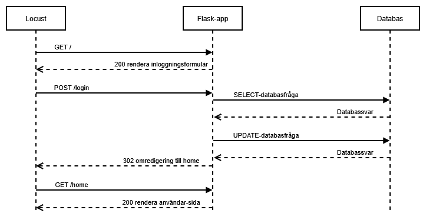
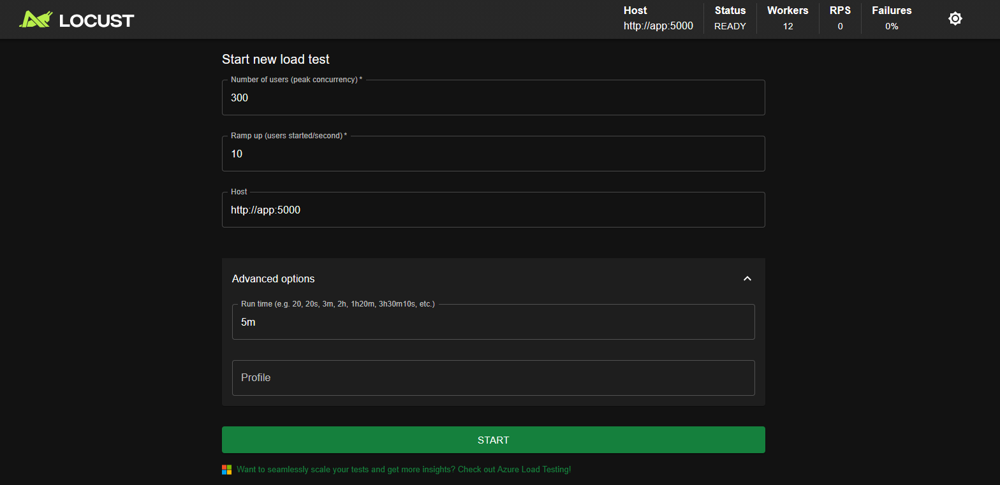
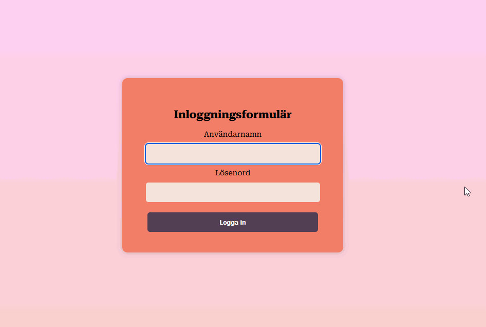

# Beskrivning
Detta projekt har skapats för kursen PA1438 på BTH. Syftet är att modellera de väntetider som en användare kan uppleva då många samtidiga användare kan logga in, och var dessa väntetider kan uppträda.

Projektet innehåller filer för att sätta upp en enkel login-applikation, samt för att belasta applikationen med samtidiga användare som loggar in.

Projektet är uppdelat i:
- Applikationen med login-funktionen.
- Locust-skriptet som simulera samtidiga användare som loggar in i applikationen.
- Databasen med användarens uppgifter, som används både av applikationen och Locust-skriptet.

## Sekvensdiagram för projektet

## Login-app
Login-applikationen har byggts i Flask, och innehåller router för index, login och home:
- Index-routen: Renderar ett HTML-formulär där användaren anger användarnamn och lösenord.
- Login-routen: Tar emot användarens login-uppgifter och verifierar dem. Användarens uppgifter hämtas från databasen, och lösenordet autentiseras med hashing-algoritmen Bcrypt. När uppgifterna har autentiserats, uppdateras databasen med tidstämpel för senaste inloggning. Användarens uppgifter skrivs till session, och användaren dirigeras sedan till home-routen.
- Home-routen: Renderar användarens inloggade hemsida, hämtar användarens uppgifter från session och visar upp på sidan. 

## Locust-skript
För att belasta login-applikationen med samtidiga användare används Python-biblioteket Locust.
Locust-skriptet har utformats så att ett visst antal (virtuella) användare skickar anrop samtidigt till en route. Det innebär att en användare tar ett användarnamn, utför hela login-flödet, och väntar mellan 1 och 5 sekunder innan den tar ett nytt användarnamn och utför login-flödet igen.

## Databas
En Postgres-databas skapas i Docker-containern utifrån Postgres officiella Docker-image. Databasen innehåller en tabell med användarens uppgifter, såsom namn, användarnamn, hashat-lösenord, och tidsstämpel för senaste inloggning. Databas-tabellen seedas med användaruppgifter som genereras med Pyhtons Faker-bibliotek, samt hashade-lösenord som genereras med hashing-funktionen Bcrypt. 
Databasen används i Locust-skriptet för att hämta användarnamn att logga in med. Databasen används också i applikationen för att hämta användarens uppgifter, och för att uppdatera med tidstämpel för senaste inloggning.

## Webbserver
Projektet använder Gunicorn tillsammans med Nginx som webbserver, för att ta emot och vidarebefordra anrop, samt köra Flask-appen. I Gunicorn används funktionen gthread, där en masterprocess startar flera arbetsprocesser för att kunna hantera flera anrop samtidigt. Nginx används för att göra applikationens server mer applikationslik, och fungerar som en 

# Installation
Tanken är att tre enheter används för att köra hela projektet; en för applikationen, en för databasen och en för Locust. 
I katalogen för Deploy finns docker-compose-filer för att starta projektet på separata enheter. Då behöver IP-adresser för varje host som används anges som environment-variablar i respektive fil.
För att köra projektet på en och samma enhet, används den första docker-compose-filen som ligger i katalogen. 
Alla docker-compose-filer utgår från skapade publika Docker-images. Nya Docker-images kan byggas utifrån de Docker-filer som finns i respektive katalog för App, Database, Locust.
Docker-containrarna startas genom att köra docker compose up -d för varje docker-compose-fil på respektive enhet. 
Docker-compose-filen för databasen kommer att skapa en databas-tabell utifrån det schema som finns i filen schema.sql, i katalogen Database. Tabellen kommer fyllas med användar-uppgifter utifrån seed-skriptet som finns i samma katalog. 
Om projektet körs på tre olika enheter behöver databasen startas innan App och Locust, eftersom dessa förutsätter att databas-tabellen finns. 

# Testkörning
För att köra en testomgång där applikationen belastas med samtidiga användare som försöker logga in, börjar man med att starta alla containrar med kommandot docker compose up -d. Genom att köra kommandot docker compose logs på enheten som har containern för Locust-skriptet, kan man se adressen för Locust webbgränssnitt, exempelvis http://0.0.0.0:8089.

Testkörningen startas genom att i Locust webbgränssnitt ange antalet samtidiga användare, hur många användare som ska läggas till per sekund tills man har uppnått antalet samtidiga användare, samt hur länge körningen ska pågå. På så sätt kan applikationen testas under olika nivåer av belastning. För att testa en låg belastning kan exempelvis antalet användare vara 5, där 1 användare läggs till för att komma upp till 5, och att körningen varar i 3 minuter.

## Locust webbgränssnitt för att ange antal användare och körningstid

# Loggning
I Locust-skriptet loggas data för varje anrop som skickas, och sparas i en .jsonl fil. I Locust genereras ett anrops-id som följer med till loggnignen i Login-applikationen, så att svarstiden i Locust kan jämföras med exekveringstiden för applikationen. 
Datan som loggas i Locust är:
- Anrops-id
- Starttid för anrop
- Namn på route som anrop skickas till
- Svarstid, alltså tiden från att anropet skickats till att svar kommer tillbaka
- Eventuella exceptions
  
För login-applikationen loggas den totala tiden för att exekvera varje route med Python-biblioteket logger. Loggarna sparas till en jsonl-fil. För login-routen loggas utöver den totala tiden för att exekvera routen även följande data:
- Tid för att göra SELECT-anrop till databasen
- Tid för att göra UPDATE-anrop till databasen
- Tider för att ansluta till databas-pool för SELECT och UPDATE-anrop
- Tid för att verifiera hashat lösenord med Bcrypt

Log-filerna sparas till logs-katalogen på host-enheten och data-katalogen i containern.

# Visualisering av inloggning

